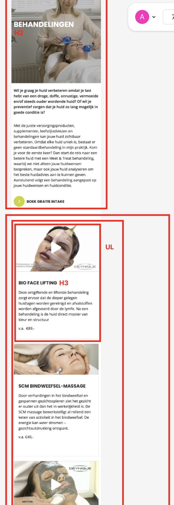

# Procesverslag
Markdown is een simpele manier om HTML te schrijven.  
Markdown cheat cheet: [Hulp bij het schrijven van Markdown](https://github.com/adam-p/markdown-here/wiki/Markdown-Cheatsheet).

Nb. De standaardstructuur en de spartaanse opmaak van de README.md zijn helemaal prima. Het gaat om de inhoud van je procesverslag. Besteedt de tijd voor pracht en praal aan je website.

Nb. Door *open* toe te voegen aan een *details* element kun je deze standaard open zetten. Fijn om dat steeds voor de relevante stuk(ken) te doen.

## Jij

  
uitwerken voor kick-off werkgroep

  ### Auteur:
  Anne van der Zwaan

  #### Je startniveau:
  Blauw

  #### Je focus:
  Focus op responsive
 

## Je website

  
uitwerken voor kick-off werkgroep

  ### Je opdracht:
  https://lennyhuidverbetering.nl

  #### Screenshot(s) van de eerste pagina (small screen): 
  Home pagina
  

  #### Screenshot(s) van de tweede pagina (small screen):
  Bahandelingen pagina
  
 

## Toegankelijkheidstest 1/2 (week 1)

  
uitwerken na test in 2e werkgroep

  ### Bevindingen
  Lijst met je bevindingen die in de test naar voren kwamen:
  We zijn begonnen met het testen met een slechtziende bril, elastiekjes om je handen en een reuma tester. Dit was erg interessant want je kon hierdoor zelf ervaren hoe het is om een 'beperking' te hebben. Ik kwam er achter dat het opzich redelijk te dien is, alleen slechtzien blijft lastig. Daarom heb ik daarna de WCAG checklist gedaan en hieruit bleek dat .....

## Breakdownschets (week 1)

  
uitwerken na afloop 3e werkgroep

  ### de hele pagina: 
  
  
  

  ### dynamisch deel (bijv menu): 
  

## Voortgang 1 (week 2)

  
uitwerken voor 1e voortgang

  ### Stand van zaken
  hier dit ging goed & dit was lastig (neem ook screenshots op van delen van je website en code)

  ### Agenda voor meeting
  Besproken tijdens meeting

  - Indeling van H1, H2 enzovoort
  - Detail summerre - voor een uitklap blokje
  - Uppercase - de tekst wordt dan in hoofdletters, dit doen ipv alles al in hoofdletters typen.
  - In mijn footer is de ul niet op de goede plek
  - &quot; ipv “
  - &copy;- voor copywrite teken 
  - leer meer hierover entity references

  ### Verslag van meeting
  Het verliep goed en ik had voor nu nog niet veel punten van verbetering. Wel de kleine puntjes van hier boven ga ik aanpassen. 

## Voortgang 2 (week 3)

  
uitwerken voor 2e voortgang

  ### Stand van zaken
  Wat ik lastig vond was dat ik de 	<a href="#" class="actie">Nu tijdelijk een proefbehandeling van €89 voor €69</a> niet goed kon stijlen. Het lukte mij en Ivo niet om de goede margin toe te voegen. uiteindelijk bleek er iets andersfout te gaan en dat was dat het element in de verkeerde section stond. hij moest helemaal niet in een section. toen dit was veranderd lukte dit wel. 

  ### Agenda voor meeting
  Besproken tijdens meeting

  - Ik bij mijn blok .startvandaag de blokken een background img gegeven, maar om hem toegankelijk te maken is dit niet de beste oplossing. Omdat de screenreader dit niet kan lezen. Ik moet position absolute gebruiken.
  - Ook hebben we gekeken naar de githup structuur en deze hebbenw e gelijk aangepast want hij wa sniet helemaal goed. De mappen stonden niet goed.
  - 

  ### Verslag van meeting
...

## Toegankelijkheidstest 2/2 (week 4)

  
uitwerken na test in 9e werkgroep

  ### Bevindingen
  Lijst met je bevindingen die in de test naar voren kwamen (geef ook aan wat er verbeterd is):

## Voortgang 3 (week 4)

  
uitwerken voor 3e voortgang

  ### Stand van zaken
  hier dit ging goed & dit was lastig (neem ook screenshots op van delen van je website en code)

  ### Agenda voor meeting
  samen met je groepje opstellen

  | student 1      | student 2          | student 3    | student 4        |
  | ---            | ---                | ---          | ---              |
  | dit bespreken  | en dit             | en ik dit    | en dan ik dat    |
  | en dat ook nog | dit als er tijd is | nog een punt | dit wil ik zeker |
  | ...            | ...                | ...          | ...              |

  ### Verslag van meeting
  hier na afloop snel de uitkomsten van de meeting vastleggen

  - punt 1
  - punt 2
  - nog een punt
  - ...

## Eindgesprek (week 5)

  
uitwerken voor eindgesprek

  ### Je uitkomst - karakteristiek screenshots:
  

  ### Dit ging goed/Heb ik geleerd: 
  Korte omschrijving met plaatjes

  

  ### Dit was lastig/Is niet gelukt:
  Korte omschrijving met plaatjes

  

## Bronnenlijst

  
continu bijhouden terwijl je werkt

  Nb. Wees specifiek ('css-tricks' als bron is bijv. niet specifiek genoeg). 
  Nb. ChatGpT en andere AI horen er ook bij.
  Nb. Vermeld de bronnen ook in je code.

  1. https://www.perplexity.ai/search/hoe-maak-ik-mijn-h1-in-de-css-ednXDrpiS0OSAzZ5bg20PQ
  2. (https://codepen.io/annevdzwaan/pen/VYazZgq)
  3. (https://www.w3schools.com/tags/tryit.asp?filename=tryhtml5_summary)
  4. https://www.w3schools.com/css/tryit.asp filename=trycss_image_text_center
  5. https://css-tricks.com/snippets/css/a-guide-to-flexbox/

