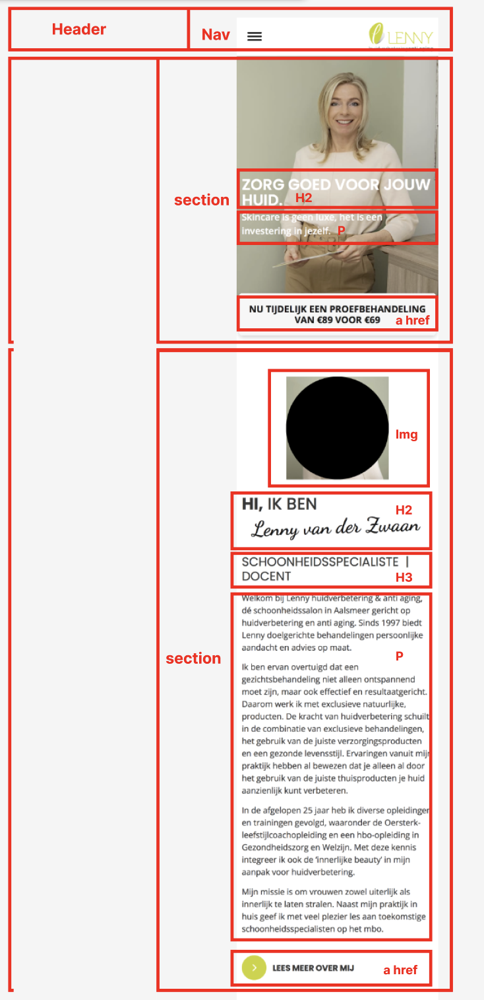
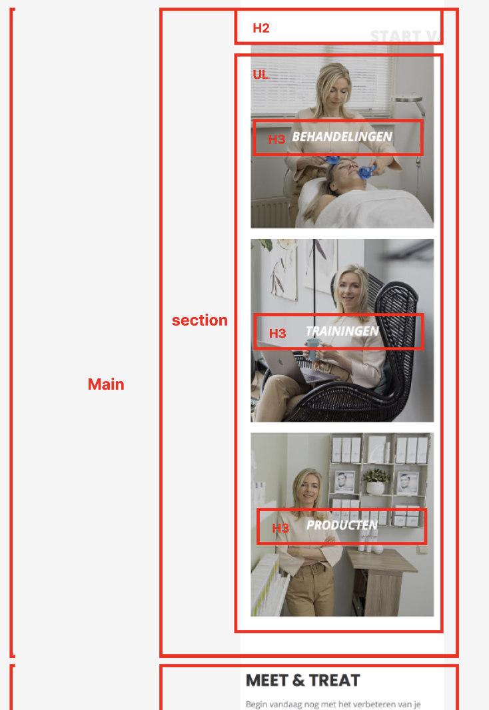
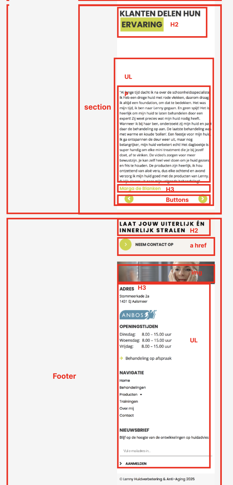
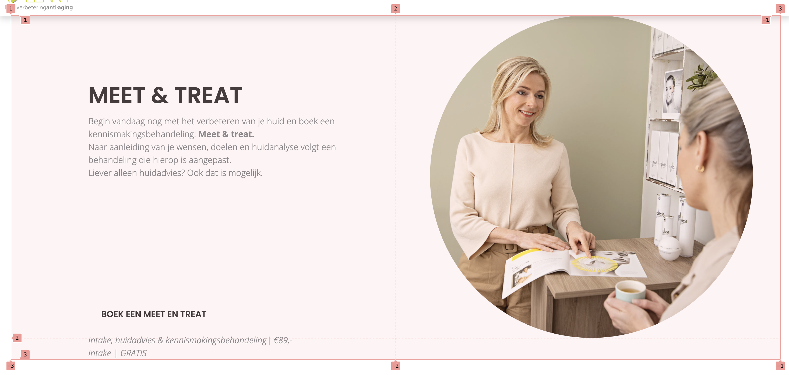

# Procesverslag
Markdown is een simpele manier om HTML te schrijven.  
Markdown cheat cheet: [Hulp bij het schrijven van Markdown](https://github.com/adam-p/markdown-here/wiki/Markdown-Cheatsheet).

Nb. De standaardstructuur en de spartaanse opmaak van de README.md zijn helemaal prima. Het gaat om de inhoud van je procesverslag. Besteedt de tijd voor pracht en praal aan je website.

Nb. Door *open* toe te voegen aan een *details* element kun je deze standaard open zetten. Fijn om dat steeds voor de relevante stuk(ken) te doen.

## Jij

  
uitwerken voor kick-off werkgroep

  ### Auteur:
  Anne van der Zwaan

  #### Je startniveau:
  Blauw

  #### Je focus:
  Focus op responsive
 

## Je website

  
uitwerken voor kick-off werkgroep

  ### Je opdracht:
  https://lennyhuidverbetering.nl

  #### Screenshot(s) van de eerste pagina (small screen): 
  Home pagina
  

  #### Screenshot(s) van de tweede pagina (small screen):
  Bahandelingen pagina
  
 

## Toegankelijkheidstest 1/2 (week 1)

  
uitwerken na test in 2e werkgroep

  ### Bevindingen
  Lijst met je bevindingen die in de test naar voren kwamen:
  We zijn begonnen met het testen met een slechtziende bril, elastiekjes om je handen en een reuma tester. Dit was erg interessant want je kon hierdoor zelf ervaren hoe het is om een 'beperking' te hebben. Ik kwam er achter dat het opzich redelijk te dien is, alleen slechtzien blijft lastig. Daarom heb ik daarna de WCAG checklist gedaan en hieruit bleek dat de website goed scoort op headings, links, images (naast background img) en contrast, maar faalt op focus states (outline: none !important), text resizing (fixed px fonts), en ontbrekende dark/high-contrast mode support.

## Breakdownschets (week 1)

  
uitwerken na afloop 3e werkgroep

  ### de hele pagina: 
  
  
  

  ### dynamisch deel (bijv menu): 
  

## Voortgang 1 (week 2)

  
uitwerken voor 1e voortgang

  ### Stand van zaken
  hier dit ging goed & dit was lastig (neem ook screenshots op van delen van je website en code)

  ### Agenda voor meeting
  Besproken tijdens meeting

  - Indeling van H1, H2 enzovoort
  - Detail summerre - voor een uitklap blokje
  - Uppercase - de tekst wordt dan in hoofdletters, dit doen ipv alles al in hoofdletters typen.
  - In mijn footer is de ul niet op de goede plek
  - &quot; ipv “
  - &copy;- voor copywrite teken 
  - leer meer hierover entity references

  ### Verslag van meeting
  Het verliep goed en ik had voor nu nog niet veel punten van verbetering. Wel de kleine puntjes van hier boven ga ik aanpassen. 

## Voortgang 2 (week 3)

  
uitwerken voor 2e voortgang

  ### Stand van zaken
  Wat ik lastig vond was dat ik de 	<a href="#" class="actie">Nu tijdelijk een proefbehandeling van €89 voor €69</a> niet goed kon stijlen. Het lukte mij en Ivo niet om de goede margin toe te voegen. uiteindelijk bleek er iets andersfout te gaan en dat was dat het element in de verkeerde section stond. hij moest helemaal niet in een section. toen dit was veranderd lukte dit wel. 

  ### Agenda voor meeting
  Besproken tijdens meeting

  - Ik bij mijn blok .startvandaag de blokken een background img gegeven, maar om hem toegankelijk te maken is dit niet de beste oplossing. Omdat de screenreader dit niet kan lezen. Ik moet position absolute gebruiken.
  - Ook hebben we gekeken naar de githup structuur en deze hebben we gelijk aangepast want hij was niet helemaal goed. De mappen stonden niet goed.
  - 

  ### Verslag van meeting
In de eerste versie hadden de blokken in .startvandaag een background-image, maar dat bleek niet toegankelijk omdat screenreaders deze afbeeldingen niet kunnen interpreteren. Daarom vervang ik de achtergrondafbeeldingen door echte img‑elementen met alt‑teksten en positioneer ik de tekst erboven met position: absolute. Daarnaast is de GitHub‑structuur opgeschoond, zodat alle bestanden nu logisch in aparte mappen zijn georganiseerd.

## Toegankelijkheidstest 2/2 (week 4)

  
uitwerken na test in 9e werkgroep

  ### Bevindingen
  <!-- Lijst met je bevindingen die in de test naar voren kwamen (geef ook aan wat er verbeterd is): -->

  Wat er verbetert is aan de website is dat er minder background img zijn gebruikt wat beter is voor de screenreader. ook is er een dark/light mode toegevoegd wat deze was er helemaal niet. 

  

## Voortgang 3 (week 4)

  
uitwerken voor 3e voortgang

  ### Stand van zaken
 Ik vond dit onderdeel lastig om te positioneren omdat dit niet lukte met flexbox. Uiteindelijk zijn we (student assistent en ik) erachter gekomen dat ik grid moest gebruiken.

 Maar ik heb het nogsteeds niet helemaal kunnen krijgen hoe ik wilde, omdat er teveel witruimte nu zit tussen het eerste deel van de tekst en de tweede. Als ik meer tijd had had ik hier meer onderzoek naar willen doen en dit werkend willen maken. 

   

  ### Agenda voor meeting
  Besproken tijdens meeting

  - Meeschalen
  - Dark mode

  ### Verslag van meeting
  We gingen even snel door mijn website en keken of de responsive goed was. Verder had ik niet veel veragen en kwam er uit dat ik lekker door moest gaan hoe het nu ging. Ook liet ik even de darkmode zien die was goed. 

## Eindgesprek (week 5)

  
uitwerken voor eindgesprek

  ### Je uitkomst - karakteristiek screenshots:
  

  ### Dit ging goed/Heb ik geleerd: 
  Ik heb geleerd hoe ik een hamburger menu maak. Ook heb ik geleerd om grid te gebruiken, dit kende ik nog niet. Darkmode/Lightmode en @media heb ik ook mee leren werken.

  

  ### Dit was lastig/Is niet gelukt:
  Flexbox en grid blijft lastig, toch ging dit redelijk goed. 
  Wat ik had willen toevoegen als ik meer tijd had waren meer animaties, bijvoorbeeld als je scrolled door de pagina dat de h2 van start vanaag nog mee scrold van links naar recht. 
  Ook wilde ik de buttons helemaal hetzelfde maken maar dit vond ik te lastig dus heb ik dit gelaten voor als ik meer tijd zou hebben, wat niet het geval was dus.

  

## Bronnenlijst

  
continu bijhouden terwijl je werkt

  1. https://www.perplexity.ai
  2. https://codepen.io/annevdzwaan/pen/VYazZgq
  3. https://www.w3schools.com/tags/tryit.asp?filename=tryhtml5_summary
  4. https://www.w3schools.com/css/tryitaspfilename=trycss_image_text_center
  5. https://css-tricks.com/snippets/css/a-guide-to-flexbox/
  6. https://www.perplexity.ai
  7. https://blog.pope.tech/2022/07/12/what-you-need-to-know-about-aria-and-how-to-fix-common-mistakes/
  8. https://css-tricks.com/snippets/css/complete-guide-grid/

